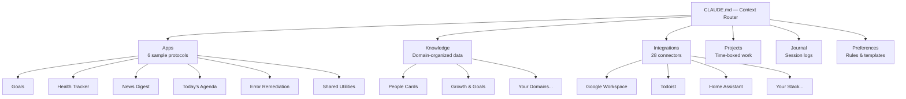

<div align="center">

<a href="https://contextium.ai">
<picture>
  <source media="(prefers-color-scheme: dark)" srcset="docs/images/logo-dark.svg" />
  <source media="(prefers-color-scheme: light)" srcset="docs/images/logo.svg" />
  
</picture>
</a>

<br/><br/>

### AI that doesn't learn isn't intelligence.

**Give your AI an operating system.**

<br/>

[](LICENSE)
[](CHANGELOG.md)

[](agent-configs/claude/)
[](agent-configs/cursor/)
[](agent-configs/codex/)
[](agent-configs/)
[](agent-configs/)
[](agent-configs/)
[](agent-configs/)
[](agent-configs/)
[](agent-configs/)
[](agent-configs/ollama/)

</div>

---

## The Problem

You can *see* what AI should be — a genuine multiplier across everything you do. But every session starts from zero. You re-explain who you are, what you're working on, and what you already decided. Decisions evaporate. Context vanishes. Knowledge never compounds.

Native AI "memory" stores a flat list of facts in a black box. That's not intelligence — it's a sticky note. There's no structure, no rules, no routing, no compounding. Your AI has the same IQ on day 1,000 as day 1.

## The Solution

Contextium is an open-source operating system for your AI. Not chat history. Not RAG. Not a prompt library. A structured git repo with persistent context, behavioral rules, multi-agent delegation, and session compounding — so every session builds on the last.

The more you use it, the richer the context becomes. Your AI learns your goals, tracks your projects, knows your relationships, follows your rules, and compounds knowledge with every session. It's the infrastructure layer that was always missing between you and your AI.

## Key Innovations

| Innovation | What It Does |
|------------|-------------|
| **Context Router** | Lazy-loads only the files relevant to the current session — no token bloat, no preloading |
| **Behavioral Enforcement** | Rules and hooks prevent AI drift — your preferences are enforced, not suggested |
| **Multi-Agent Delegation** | Routes work to the right AI: Claude for strategy, Gemini for research, Codex for bulk edits |
| **Session Compounding** | Journal entries + git history = every session builds on every previous session |
| **You Own Your Context** | Plain markdown on your machine — switch AI agents, change providers, or leave entirely. Your accumulated intelligence stays with you, forever |
| **Your AI Actually Knows You** | After a month, your AI knows your goals, relationships, decisions, and communication style. Not a generic assistant — *your* assistant |
| **Audit Trail** | Every decision is git-versioned. `git log` any choice from 6 months ago — what you decided, what you rejected, and why |
| **Cost-Aware Delegation** | Claude for strategy, Gemini for research, Codex for bulk edits — each at the right cost. More leverage, less spend |
| **One-Command Setup** | The installer handles everything — name, AI agent, integrations, CLI install, and launches your first session |

## Quick Start

```bash
curl -sSL contextium.ai/install | bash
```

That's it. The installer walks you through everything: your name, your AI agent, which integrations to include — then installs your agent's CLI and opens it in your new Contextium. You'll be onboarding in under a minute.

For deeper configuration after onboarding, check the pre-loaded projects in `projects/setup/`.

## Architecture



The `CLAUDE.md` file at the repo root acts as a router. When your AI starts a session, it reads this file to understand the repo structure and uses the trigger table to lazy-load only what's relevant.

## What's Included

### Sample Apps (6 patterns)

| App | Pattern | What It Does |
|-----|---------|-------------|
| **Goals** | Reference | Personal and professional goal tracking with periodic review |
| **Health Tracker** | Data Sync | Biomarker, supplement, and health decision tracking |
| **News Digest** | Timer + Email | AI-curated daily news digest from RSS feeds |
| **Today's Agenda** | Briefing | Morning email with calendar, tasks, and focus blocks |
| **Error Remediation** | System/Event | Auto-retry, diagnose, and escalate system errors |
| **Shared Utilities** | Utility | Reusable notification, email, and validation functions |

Each app is a self-contained directory with a README protocol that your AI follows. Add your own by copying the pattern.

### Integration Connectors (28)

Organized by category. Each connector has a README with setup instructions — configure only what you need.

| Category | Connectors |
|----------|-----------|
| **Credentials** | 1Password |
| **Productivity** | Google Workspace, Todoist, Google Auth |
| **Automation** | Windmill, n8n |
| **Infrastructure** | Cloudflare, TrueNAS, Daedalus (runtime) |
| **AI Agents** | Gemini, Codex, Ollama, Browse (Playwright) |
| **Business** | QuickBooks Online, Autotask, HuduIT, NinjaOne, MSPbots, Monarch, Strety |
| **Smart Home** | Home Assistant, Garage |
| **Interfaces** | TRMNL (e-ink display), VS Code, Remote Control |
| **Knowledge** | Host Docs Map, Hapi |

### Setup Projects (5)

After the 5-minute onboarding, deeper configuration is available as self-paced projects:

| Project | What You'll Set Up |
|---------|-------------------|
| `projects/setup/integrations/` | Connect your external services (APIs, credentials, webhooks) |
| `projects/setup/people-cards/` | Build your relationship directory with context your AI can use |
| `projects/setup/health-tracking/` | Track biomarkers, supplements, and health decisions over time |
| `projects/setup/automation/` | Build your first scheduled workflow with Windmill or n8n |
| `projects/setup/daily-briefing/` | Configure a morning email with your calendar, tasks, and focus |

## How It Works

### Session Lifecycle

1. **Start a session** — Your AI reads `CLAUDE.md`, loads your preferences, and classifies the work (new project, existing work, or one-off task).
2. **Work on a task** — The context router lazy-loads relevant files as needed: people cards, project READMEs, integration docs, prior journal entries.
3. **End the session** — A journal entry captures what was decided and what comes next. Changes are committed and pushed.
4. **Next session** — Your AI has full history of what you did, what you decided, and why. No repetition. No context loss.

### Context Router

The `CLAUDE.md` file contains a trigger table. Your AI doesn't preload your entire repo — it loads files based on what you're doing:

| When you... | AI loads... |
|-------------|------------|
| Start any session | `preferences/user/preferences.md` |
| Mention a person | `knowledge/people/{name}/` |
| Work on a project | `projects/{domain}/{project}/README.md` |
| Call an API or service | `integrations/{name}/README.md` |
| Reference prior work | `journal/` (latest entries) |
| Need credentials | `integrations/1password/README.md` |

This prevents token bloat while ensuring the right context is always available.

### Delegation Architecture

Your primary AI stays focused on strategy. Research and heavy lifting get delegated:

| Need | Route To | Why |
|------|----------|-----|
| Web research | Gemini CLI | Summarizes externally, only the result enters context |
| Bulk file edits | Codex CLI | Operates in a separate context window at lower cost |
| Browser automation | Browse | Playwright-based, runs as an isolated subprocess |
| Local/private inference | Ollama | Runs locally, no API cost, works offline |
| Scheduled tasks | Windmill / n8n | Deterministic execution, no AI cost per run |

### Update System

Framework updates without losing your data:

```bash
./install.sh update
```

Your personal data in `preferences/user/`, `knowledge/`, `journal/`, and `projects/` is protected during updates via `.gitattributes` merge strategies. Only framework files (apps, integrations, docs, templates) get updated.

See [docs/update-guide.md](docs/update-guide.md) for details.

## Built With This Framework

Contextium was developed and battle-tested in a production environment before being open-sourced. The framework that ships here is a distilled version of a system proven at scale:

- **35+ app protocols** running across personal, business, and infrastructure domains
- **100+ completed projects** tracked with full decision history
- **600+ journal entries** capturing context that compounds daily
- **28 live integrations** connecting to external services and APIs
- **Multi-agent delegation** across Claude, Gemini, and Codex in daily use

Every pattern in this repo was refined through sustained daily use — not theoretical design.

## Philosophy

**Context as infrastructure.** Your AI's effectiveness is directly proportional to the context it has. Most people treat AI as stateless — they type a prompt, get a response, and lose everything. Contextium treats context as infrastructure: persistent, structured, version-controlled.

**Lazy loading over preloading.** Don't dump your entire life into the AI's context window. Load only what's relevant, when it's relevant. The context router makes this automatic.

**Delegation over monolith.** One AI can't do everything efficiently. Route research to Gemini, bulk edits to Codex, strategy to Claude. Each agent gets the right task at the right cost.

**You own your context.** Every other AI tool locks your accumulated context inside their platform. If they change pricing, shut down, or you just want to switch — you lose everything. Contextium is plain markdown on your machine. Switch from Claude to Gemini tomorrow. Your context, your decisions, your knowledge — all of it comes with you.

**Institutional memory for individuals.** Companies have wikis, CRMs, and project management tools. Individuals have nothing. Your career knowledge, health decisions, financial strategy, relationship context — it all lives in your head until you forget it. Contextium is the institutional memory you never had.

**Sessions compound.** Every journal entry, every project README, every people card makes the next session richer. This is the flywheel.

## Contributing

We welcome contributions — especially new app protocols and integration connectors. See [CONTRIBUTING.md](CONTRIBUTING.md) for guidelines.

## Documentation

| Doc | What's In It |
|-----|-------------|
| [Getting Started](docs/getting-started.md) | Installation and your first 5 minutes |
| [Architecture](docs/architecture.md) | System design deep-dive |
| [Onboarding Guide](docs/onboarding-guide.md) | What happens when you say "let's onboard" |
| [Update Guide](docs/update-guide.md) | How to pull framework updates safely |
| [Capability Catalogue](docs/capability-catalogue.md) | Every feature and pattern documented |

## License

[Apache 2.0](LICENSE) — use it, modify it, share it.

---

<div align="center">

**[Getting Started](docs/getting-started.md)** · **[Architecture](docs/architecture.md)** · **[Capability Catalogue](docs/capability-catalogue.md)** · **[Update Guide](docs/update-guide.md)**

</div>
